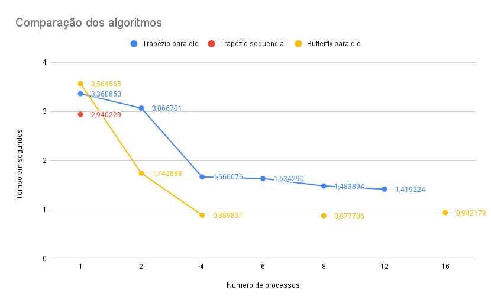

# Sistemas Distribuídos

## Trabalho final

A descrição do trabalho se encontra em `trabalho-final.pdf`.

Questão:

a) Para calcular a integral pelo método do trapézio, de forma sequencial, execute `python3 sequencial.py`.

b) Para calcular a integral pelo método do trapézio,onde o mestre processa, de forma paralela, execute `mpiexec -np <n> python3 mestre-processa.py`, onde n = número de processos.

c) Para calcular a integral pelo método butterfly de forma paralela, execute `mpiexec -np <n> python3 butterfly.py`, onde n = número de processos. Lembrando que neste caso n deve ser sempre potência de 2: 1, 2, 4, 8, 16...".

### Relatório

A partir da plotagem do gráfico (Figura 1), é possível analisar a eficiência de cada algoritmo.

O algoritmo sequencial pelo método do trapézio foi mais eficiente para 1 processamento, pois o cálculo é simples. Se o cálculo fosse mais custoso, por exemplo com uma quantidade de dados muito grande para processar, o algoritmo não seria tão eficiente.

Para os demais números de processamento, o algoritmo em paralelo pelo método butterfly foi mais eficiente, já que busca minimizar o processamento e a comunicação realizada e aumentar o desempenho do processo, comparado com o algoritmo do trapézio em paralelo.

|  |
| :----------------------: |
|         Figura 1         |
