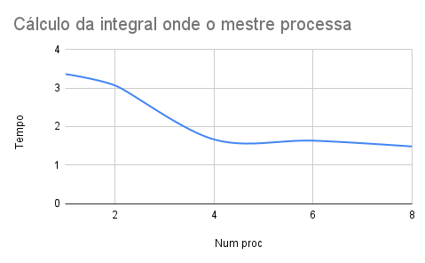
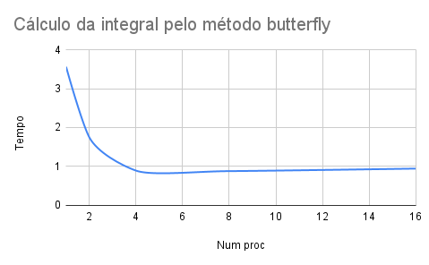

# Sistemas Distribuídos

## Trabalho final

A descrição do trabalho se encontra em `trabalho-final.pdf`.

Questão:

a) Para calcular a integral pelo método do trapézio, de forma sequencial, execute `python3 sequencial.py`.

b) Para calcular a integral onde o mestre processa execute `mpiexec -np <n> python3 mestre-processa.py`, onde n = número de processos.

c) Para calcular a integral utilizando o método butterfly execute `mpiexec -np <n> python3 butterfly.py`, onde n = número de processos. Lembrando que neste caso n deve ser sempre potência de 2: 1, 2, 4, 8, 16...".

### Relatório

A partir da plotagem dos gráficos nas figuras 1 e 2, é possível observar que o cálculo pelo método butterfly (Figura 2) custou menos tempo comparado com o do método do trapézio, onde o mestre processa (Figura 1).

Isso aconteceu porque o algoritmo butterfly busca minimizar o processamento e a comunicação realizada e aumentar o desempenho do processo, sendo então mais eficiente para este caso.

|  |
| :---------------------------------------: |
|                 Figura 1                  |

|  |
| :---------------------------------: |
|              Figura 2               |
